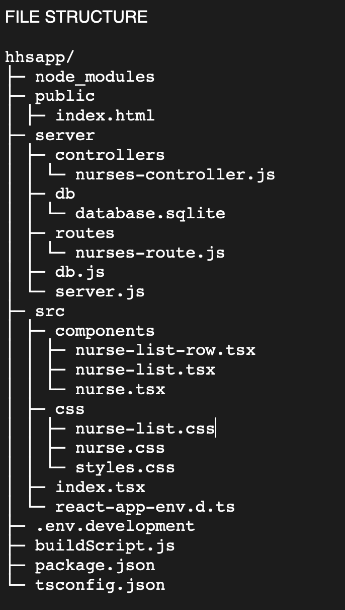

HHS APP
______

AN APP TO MAINTAIN A LIST OF NURSES AT A HOSPITAL

The homepage includes a form (from which you can search, add, and edit a nurse) and a list to display nurses from the database and where the controls for editing and deleting a nurse lie. Pagination begins after 5 nurses have been listed.

Search a nurse by first name and/or last name. Results will appear below. If fields are empty, all nurses will be listed with pagination.

Search nurses by ward will list all nurses on the ward below. If fields are empty, all nurses will be listed with pagination.

Nurses can be added as long as all fields are filled in (> 0 characters) and the ward name is valid. Future improvements include regex to check email address as well as character length validations for first and last names.

LANGUAGE: 

Typescript

STACK:

SQLite
Express
React
Node

Basic CSS

FEATURES/REQUIREMENTS

Nurse Object: 

Create
Read
Update
Delete

Nurses Table:

Search
Pagination

————

FRONTEND 
UX/UI
	
FORM (CREATE)
- Add a new nurse:
	- form checks that no fields are empty excluding the employeeID which is 		autogenerated and incremented
	- use a function that takes in parameters of their details, 
	- create an ID number that is autogenerated,
	- instantiate a new nurse obj with the details and,
	- adds them to the nurses table

LIST (READ) of nurses will show (all if pagination is incomplete)
- Search for a nurse by NAME:
	- form will pass first and last name values to GET request as params
	- params will be extracted to build query in KNEX instance
	- response will contain array of nurse(s) that satisfy query
	- call fetchNurses to set results in nurse list
	
	- if no given filter, return ALL nurses in order they were added

- Search for a nurse by WARD:
	- form will pass ward value to GET request as param
	-params will be extracted to build query as above,
	- res will contain array of nurses that satisfy ward query
	- return a list of nurses in order they were added in the same ward

	- if no given ward value, return ALL nurses in order they were added

- Search filter for NURSE name AND WARD name
	- return nurses with matching first AND/OR last name AND assigned to that ward

	- if no given filter, return ALL nurses in order they were added

- LIST PAGINATION of results; add limit of 5 nurses per page (include 10 nurses in database if there’s time)

FORM (UPDATE) 
	- edit button for each nurse in list
	- populates CREATE FORM with selected nurse’s data using employee id
	- prevent employee id from being edited as it is used as the primary key
	- add validations to ensure values cannot be empty
	- save button is added near the create form in edit mode
	- updates the record by sending new values in a POST request to the database
	- list is refreshed to add new nurse and form is cleared of values

LIST (DELETE) 
	- delete button for each nurse in list
	- sends a PUT request to the database to delete the record based on the id
	- refresh nurses list

for dev: when list reaches over 10 entries, a reset table button will appear at bottom to give option to drop table

***Maybe each listed nurse can have a coloured card matching the ward name; changes when ward is edited**** May help with quicker identification; visual accessibility 

ACCESSIBILITY: 
- Better to alternate colours between nurses in list to provide contrast

————
————

Entity Relationship Diagram?

There are two distinct entities with their own properties involved: Nurses and Wards; their relationship is ONE-TO-MANY since each nurse has a ward and a ward can have multiple nurses/ other staff.

However for the sake of time, there is no need for a Ward table since we only need to search by it. We will simply use it as a query parameter.	

table nurses  =  {

firstName: string not null,
lastName: string not null,
wardName: string (foreign key) not null,
employeeID: integer (primary key, autogenerated) not null,
email: string not null

}

______

FILE STRUCTURE

————

COMMANDS

	npm start
	node server.js
____

RESOURCES 

https://www.atlassian.com/git/tutorials/saving-changes/gitignore
https://stackoverflow.com/questions/40947650/axios-get-in-url-works-but-with-second-parameter-as-object-it-doesnt
https://knexjs.org/guide/query-builder.html#upsert
https://blog.shahednasser.com/knex-js-tutorial-for-beginners/
https://editor.datatables.net/manual/nodejs/conditions
https://dev.to/cesareferrari/updating-a-record-with-knex-in-a-rest-api-2nck#:~:text=In%20order%20to%20update%20one,we%20showed%20in%20previous%20articles.
https://bobbyhadz.com/blog/react-referenceerror-process-not-defined
https://blog.alexdevero.com/react-express-sqlite-app/
https://stackoverflow.com/questions/70368760/react-uncaught-referenceerror-process-is-not-defined
https://www.youtube.com/watch?v=TQtAtBJeiPc
https://stackoverflow.com/questions/56397239/default-query-params-not-getting-passed-in-axios-request
https://knexjs.org/guide/schema-builder.html#createtablelike
https://www.reddit.com/r/learnjavascript/comments/8fm0yj/what_am_i_doing_wrong_in_this_axiosget_request/
https://stackoverflow.com/questions/64207505/axios-get-with-params

For pagination
https://www.youtube.com/watch?v=IYCa1F-OWmk
